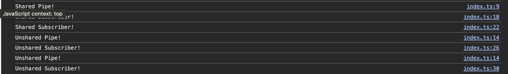

# Observable Sharing

책에서 `share()`를 사용하는 예제가 있는데, `share()`를 사용하는 이유가 무엇인지 설명한다.

## Hot Observable에는 필요가 없는 공유

`fromEvent` 등은 Hot Observable이기 때문에 1회만 실행되며 따라서 `share`가 필요 없다.

## pipe로 생성한 신규 Cold Observable

다만 Hot Observable에 `pipe`를 달아 새로운 `Observable`을 만드는 경우에는 Cold Observable이 반환되므로, Observer의 개수만큼 해당 `pipe`가 실행되게 된다.

## Cold Observable 공유에 사용하는 `share()`

만약 `pipe`가 Hot Observable을 확장하는 경우여서 1회만 실행되어야 하거나 1회만 실행되어도 충분한 경우 `share()`를 사용하는 게 적절할 수 있다.
