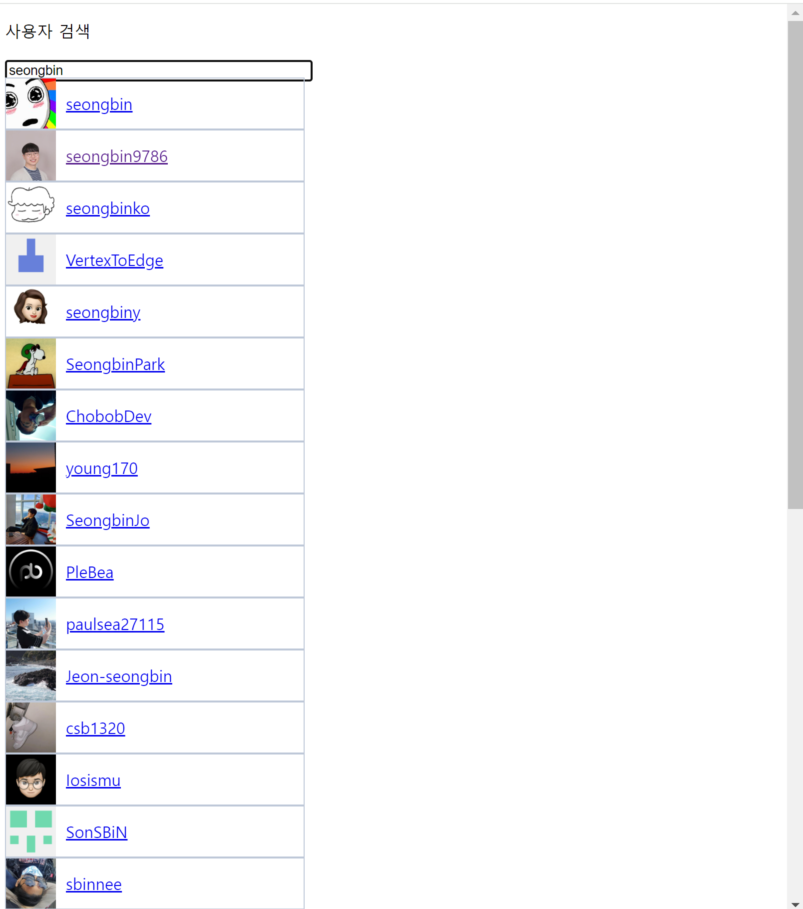
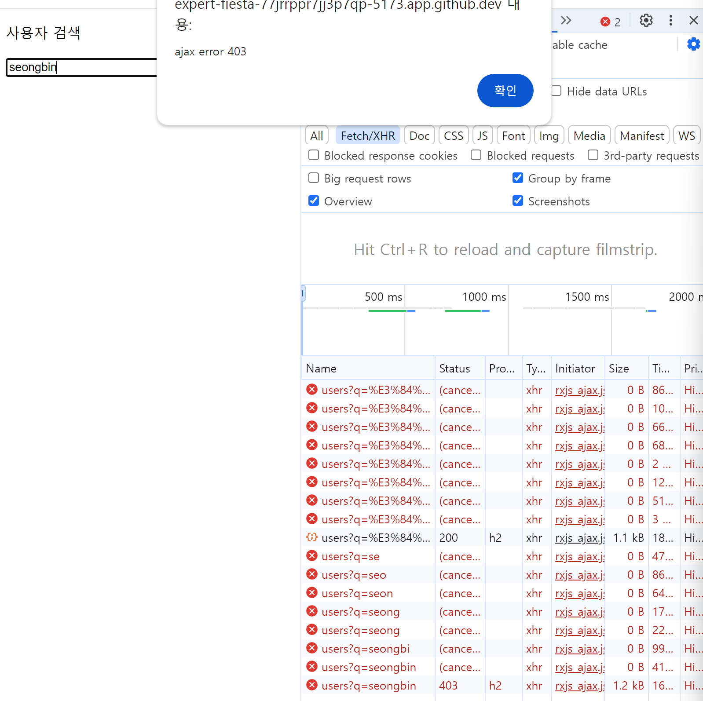
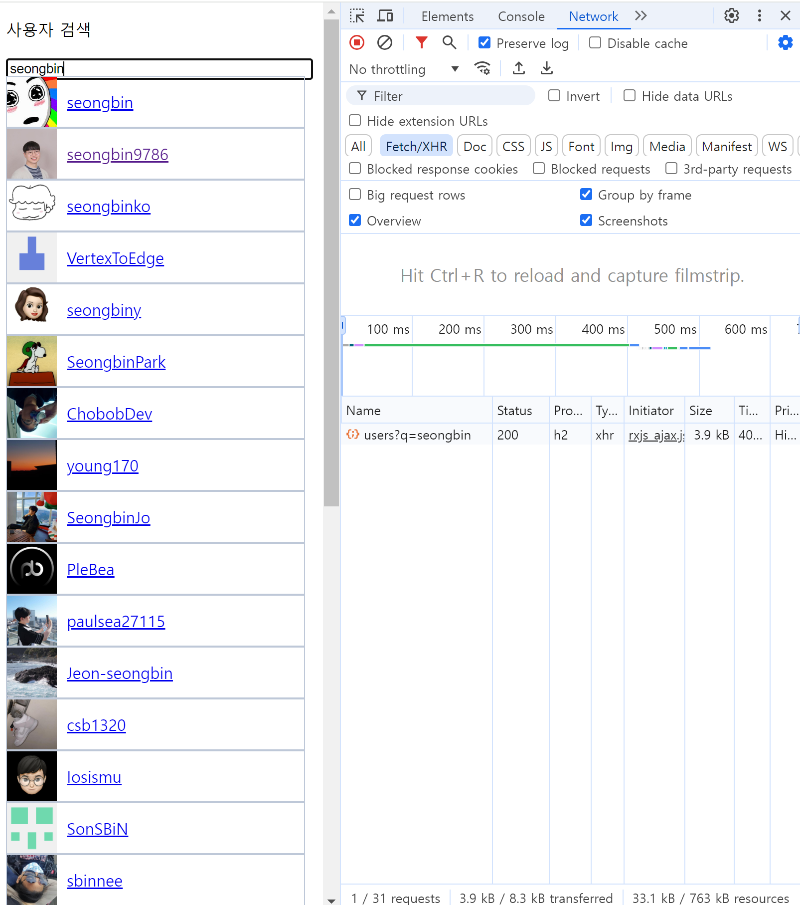
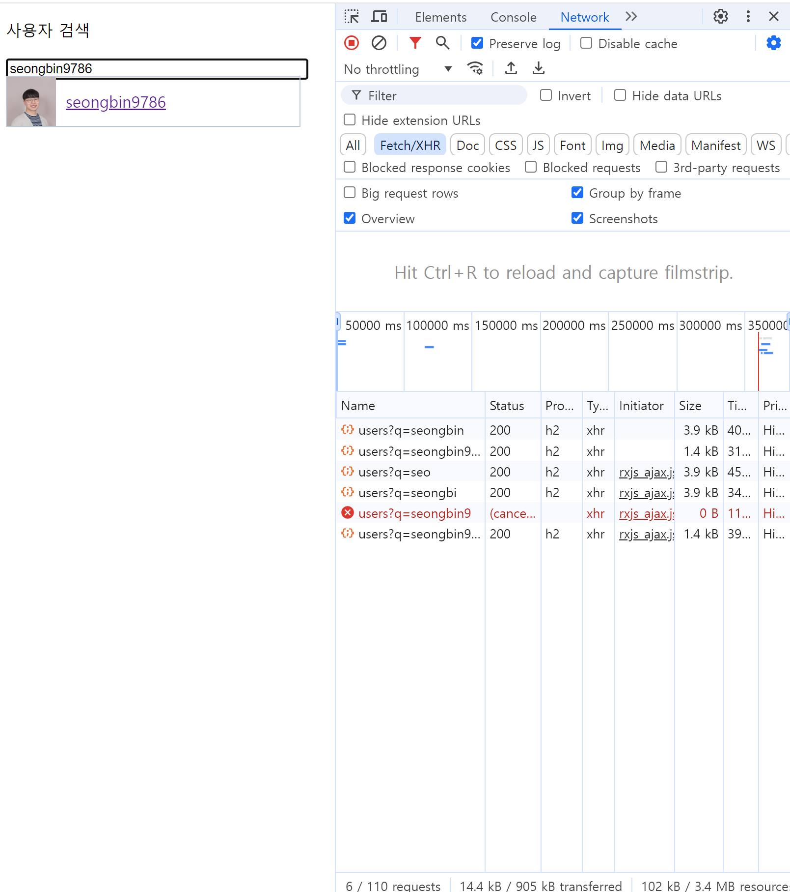

# 자동완성 UI를 rxjs로 만들기

## 1. 기능 요구 사항

다음과 같은 화면을 구현합니다.



### 1-1. 기능 명세

1. `<input>`에 검색어를 입력하면 API를 호출한 응답으로 자동 완성 목록을 만들어 `<input>` 밑에 표시합니다.
2. 서버 호출을 줄여 Rate Limit을 피합니다.
  - 
3. 검색어를 입력하면 목록이 표시되기 전까지는 로딩 화면이 표시됩니다.
4. 검색어를 모두 지우면 자동 완성 목록이 사라집니다.
5. 실패 시 2회 re-try하며, 그동안 로딩 스피너를 계속 표시합니다.

## 2. 구현 방법

### 2-1. [요구 사항 1] `<input>`에 검색어를 입력하면 API를 호출한 응답으로 자동 완성 목록을 만들어 `<input>` 밑에 표시합니다.

#### 2-1-1. 요구 사항 분석: 3개로 분할

1. [계산] 화면 구성: 임의의 목록이 주어지면 그것을 화면으로 표현합니다.
2. [액션] 렌더링 함수 작성: (1)을 파라미터화하고, `innerHTML`로 화면을 설정합니다.
2. [액션] 이벤트 - API - 렌더링 함수 연동: input 이벤트에 API를 연동하고 렌더링 함수를 호출합니다.

#### 2-1-2. 화면 구성 (퍼블리싱)

- list 자체는 면적이 없어서 항상 표시되게 만듭니다.
- item이 하나라도 있으면 list가 표시되게 합니다.

```html
<div class="autocomplete-root">
    <input
        id="search"
        type="input"
        placeholder="검색하고 싶은 사용자 아이디를 입력해주세요"
    />
    <!-- 자동 완성 목록 Element는 input 아래에 고정시킨다. -->
    <ul id="autocomplete-list"></ul>
</div>
```

```css
.autocomplete-root {
  position: relative;
  width: 300px;
}

#search {
  width: 100%;
}

#autocomplete-list {
  position: absolute;
  top: 20px;
  color: #666;
  padding: 0px;
  margin: 0px;
  width: 100%;
}
```

#### 2-1-3. 렌더링 함수 작성

- 각 Item 단위를 퍼블리싱을 합니다.
- 간단하게 프로필 사진과 닉네임을 표시합니다.

```html
<li class="user">
    
    <p><a href="https://github.com/..." target="_blank">seongbin9786</a></p>
</li>
```

```css
#autocomplete-list li {
  border: 1px solid #bec8d8;
  list-style: none;
}

.user img {
  position: relative;
  float: left;
  margin-right: 10px;
}

.user p {
  line-height: 50px;
  margin: 0px;
  padding: 0px;
}
```

- API 타입과 호출 코드를 작성합니다.

```ts
// GitHub API
export interface Item {
  avatar_url: string;
  html_url: string;
  login: string;
}

interface GitHubUserListAPIResponse {
  items: Item[];
}

// rxjs ajax는 Observable을 반환합니다.
// switchMap으로 사용되는 것을 의도합니다.
// switchMap은 `(data) => Observable`인 함수를 받아
// 해당 Observable의 data들을 반환하는 operator입니다.
// 즉 searchTerm => GitHubUserListAPIResponse인 파이프라인이 됩니다.
const getGitHubUserListByName = (query: string) =>
  ajax.getJSON<GitHubUserListAPIResponse>(
    `https://api.github.com/search/users?q=${query}`,
  );

- Item 목록을 받아서 렌더링하는 함수를 작성합니다.

// HTML Render
const $autoCompleteList = document.getElementById("autocomplete-list")!;

function drawAutoCompleteListItems(items: Item[]) {
  $autoCompleteList.innerHTML = items
    .map(
      (item) => `
        <li class="user">
            
            <p><a href="${item.html_url}" target="_blank">${item.login}</a></p>
        </li>
    `,
    )
    .join("");
}
```

#### 2-1-4. 이벤트 - API - 렌더링 함수 연동 (rxjs)

이벤트를 Observable로 만들고, 연동하는 파이프라인은 rxjs로 작성합니다.

- 이벤트를 Observable로 만듭니다.
- 이벤트의 데이터를 API Response로 매핑합니다.

```ts
const rawSearchTermKeyUp$ = fromEvent(document.getElementById("search")!, "keyup");
```

- 이벤트를 후처리하는 파이프라인을 작성합니다.
  1. `<input>`에서 입력 값을 추출합니다.
  2. API 호출 함수를 호출하고 API Response를 data로 반환합니다.

```ts
const searchTermKeyUp$ = rawSearchTermKeyUp$.pipe(
  map((event) => (event.target as HTMLInputElement).value),
  // 위에서 rxjs ajax를 사용해서 switchMap만 써도 충분합니다.
  switchMap(getGitHubUserListByName),
);

// API Response를 data로 받으므로 HTML Render 함수를 호출합니다.
onSearchTermKeyUp$.subscribe((v) => drawAutoCompleteListItems(v.items));
```

### 2-2. [요구 사항 2] 서버 호출을 줄여 Rate Limit을 피합니다.

- GitHub API는 짧은 시간(몇 초) 내에 많이(10 건 정도) 요청하면 403 Forbidden 응답을 받고 잠시간(15초 가량) 차단됩니다.

- 원인 분석
  - Network 탭으로 확인해보면 keyup 이벤트가 굉장히 자주 발생하는 걸 알 수 있습니다.
    - 각 타이핑 마다 많이 발생하고,
    - 동일한 키워드여도 검색어 입력이 아니라 방향키 입력 등 사소한 입력일 때도 발생합니다.

- 해결 방법
  - 타이핑마다 많이 발생하는 문제는 `debounce` operator로 해결할 수 있는데요, 
    - `debounce`는 가장 마지막 데이터 발생 시 일정 기간 `timeout` 후 데이터을 반환하는 operator입니다.
    - 쉬지 않고 타이핑을 해도 입력 간 최대 텀이 250ms 정도 발생하기 때문에 300ms 정도로 timeout을 설정하면 적정한 요청 횟수를 의도할 수 있습니다.
    - `throttle` operator를 사용하면 응답성을 조금 더 높일 수 있는데요, `timeout` 마다 최대 1회 데이터를 반환합니다. 선 delay가 없기 때문에 
  - 방향키 등 사소한 입력에도 요청하는 문제는 `distinctUntilChanged` operator로 해결할 수 있는데요,
    - 같은 데이터이면 데이터를 반환하지 않는 operator입니다.
  - `debounce`, `distinctUntilChanged` 순으로 파이프라인을 구성하면 적절할 것 같습니다. (그 반대의 순서인 경우 `distinctUntilChanged`가 모든 keyup에 대해 호출되므로 조금 덜 효율적입니다)

```ts
const searchTermKeyUp$ = rawSearchTermKeyUp$.pipe(
  map((event) => (event.target as HTMLInputElement).value),
  debounceTime(300),
  distinctUntilChanged(),
  switchMap(getGitHubUserListByName),
);
```

적용 결과 "seongbin9786"을 입력한 후에야 검색 요청이 1회 발생함을 확인할 수 있습니다.

또한 Ctrl + A, 방향키든 검색과 무관한 키보드 이벤트 발생 시에는 API 호출이 발생하지 않음을 확인할 수 있습니다.



throttle을 사용한 경우에는 요청 횟수가 꽤 많음을 확인할 수 있습니다. (timeout=300ms 기준)



### 2-3. [요구 사항 3] 검색어를 입력하면 목록이 표시되기 전까지는 로딩 화면이 표시됩니다.


### 2-4. [요구 사항 4] 검색어를 모두 지우면 자동 완성 목록이 사라집니다.


### 2-5. [요구 사항 5] 실패 시 2회 re-try하며, 그동안 로딩 스피너를 계속 표시합니다.


